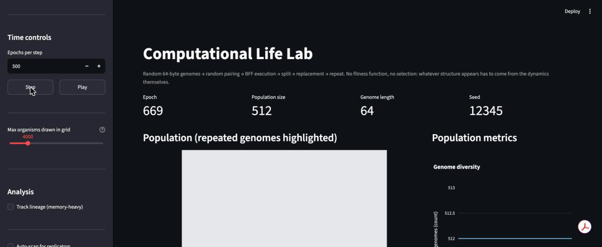

# Dashboard guide

```bash
streamlit run app/streamlit_app.py
```

<p align="center">
  
</p>

The dashboard (`app/streamlit_app.py`, with pure presentation helpers
in `app/rendering.py`) calls the exact same engine as the CLI —
`BffSoupUniverse`, `compute_metrics`, and everything under
`analysis/` — directly. It contains no simulation logic of its own,
so a run started via `life run` and inspected here, or a run started
here and continued via `life run --resume-from`, produce identical
numbers. This page walks through every section, in the order they
appear.

## Starting a run

**Experiment** (sidebar): pick a shipped config (see
[`configuration.md`](configuration.md#shipped-configs)), optionally
override its seed, and click **Reset / (Re)initialize**. This always
starts a fresh random population from the chosen config — for
continuing a previous run, see "Load stored run" below instead.

**Time controls** (sidebar): **Step** advances the loaded universe by
"epochs per step" epochs; **Play** repeats that automatically (roughly
every 50ms) until **Pause**. Both call `universe.step_epoch()` directly
— there is no separate "preview" mode, this is the real engine running
live in your browser session.

## Loading a run you started elsewhere

**Load stored run** (sidebar): point it at a `--db` SQLite file (it
auto-discovers `runs/*.db`), pick a run from the list, and load it. If
that run has a saved checkpoint (see [`cli_reference.md`](cli_reference.md#life-run)),
this does two things at once:

1. Restores the **actual** population, ancestry bookkeeping, and RNG
   substream state via `storage.checkpoints.load_checkpoint` — not a
   read-only summary. The loaded universe is a fully live
   `BffSoupUniverse`; Step and Play continue it forward exactly like any
   other universe, from precisely where the checkpoint left off.
2. Pulls in the run's full metrics history from the database, so the
   charts show the real trajectory from epoch 0 onward, not just
   whatever happens to accumulate in this browser session.

A banner at the top of the page ("Viewing run #N... resumed from its
checkpoint at epoch E") confirms what's loaded. A run with no saved
checkpoint is refused with an explanation rather than silently showing
metrics with no population behind them.

This is the intended way to check on a multi-hour or multi-day
background run (see [Performance](../README.md#performance)) without
waiting for it to finish, or babysitting it live.

## Watching the population

**Population (repeated genomes highlighted)**: one cell per organism
(subsampled for large populations — the "max organisms drawn in grid"
slider controls how many; the simulation itself always runs on the
full population regardless of what's drawn). Most cells are a neutral
gray, meaning that organism's genome is currently unique in the
displayed sample — with 256^genome_length possible 64-byte genomes, an
exact duplicate arising by pure chance is astronomically unlikely, so
gray is the expected, uninformative default. Up to 12 of the most
frequent *repeated* genomes get their own distinct, bright color
instead (a legend below the grid shows each one's count and share of
the sample); any others that repeat but don't make that cut share one
darker gray "overflow" color, still distinguishable from true
singletons. A growing, persistent patch of one bright color — not just
one snapshot's coincidence — is the signal worth following up on with
the replication scan below. (An earlier version of this grid gave every
unique genome its own color from a continuous rainbow scale; that
produces near-total visual noise once the population is diverse, since
almost every cell then gets a different, essentially arbitrary color —
this scheme was replaced because it didn't get more readable at any
population size or scale of the visualization.)

**Population metrics**: genome diversity (unique genome count) and
dominant-genome frequency over the run's recorded history. Purely
descriptive counts — not replicator or species classifications (see
[`analysis_methods.md`](analysis_methods.md)).

**Diversity, entropy & complexity**: Simpson's diversity index; all
three entropy levels (genome/byte/instruction) on one chart, since
they're easy to conflate; and the two compression-based complexity
proxies. Full definitions and formulas in
[`analysis_methods.md`](analysis_methods.md).

## Inspecting one organism

**Genome inspector**: pick any organism by population index (its slot,
0 to `population_size - 1` — not its globally-unique id, which changes
every epoch since every slot gets a fresh organism every epoch). Shows:

- Identity: organism id, generation, birth epoch, age, both parent ids.
- The genome itself, rendered byte-by-byte: active instructions bolded,
  the NULL sentinel shown faint, NOP bytes shown as small hex codes
  (see [`bff_semantics.md`](bff_semantics.md#2-byte-encoding-is-literal-ascii-plus-one-reserved-sentinel)
  for what counts as which).
- Its instruction distribution as a bar chart.
- **Lineage**: if lineage tracking is on (see below) and this organism
  was recorded, ancestor/descendant counts and a graph laying out its
  recorded ancestors and descendants by generation. This is a DAG, not
  a tree — every organism has two parents, so two lineages can merge
  back into one — and the graph says so rather than inventing a single
  "founder" per organism (see [`analysis_methods.md`](analysis_methods.md#lineage-tracking-analysislineagepy)).
- **Replication check**: an on-demand button (not automatic — it costs
  65 BFF executions) running the same replication-consistency scan
  described in [`analysis_methods.md`](analysis_methods.md#replication-detection-analysisreplicationpy)
  on this one genome.

**Track lineage** (sidebar, under Analysis): opt-in, since it's
memory-heavy (one entry per organism ever created — see
[`analysis_methods.md`](analysis_methods.md#lineage-tracking-analysislineagepy)). Turning
it on mid-run starts recording *from that point forward*; ancestry from
before that point was never captured and can't be recovered.

**Auto-scan for replicators** (sidebar, under Analysis): opt-in
checkbox that runs the same replication-consistency check as `life run
--replication-scan-interval` (see
[`cli_reference.md`](cli_reference.md#life-run)) automatically every
"scan interval" epochs while you Step or Play, instead of only finding
out via the manual scan section further down the page. A caption below
the "Load stored run" banner shows the most recent scan's epoch, best
score, and classification, and a success banner appears the first time
a candidate replicator is seen, so a multi-day run doesn't need
constant manual checking to notice when something interesting emerges.
If the session was loaded via "Load stored run" (so a database and run
id are known), each scan is also persisted as a `replication_scan`
event and the first detection as a `candidate_replicator_detected`
event — identical to what `--db` does for the CLI — so it shows up in
`life analyze` too; a fresh, unattached session only shows the result
live. Interval and sample size persist across Reset the same way
"Track lineage" does; only the last-result/first-detection state resets.

## Debugging execution by hand

**Execution debugger**: pick any two organisms, concatenate their
*current* genomes into a 128-byte tape, and step through BFF execution
instruction by instruction (Step / Run to halt / Reset) using the same
scalar interpreter the engine's own correctness tests use. head0/head1/pc
are highlighted in blue/red/green — the same color scheme the reference
`cubff` implementation uses for its own debug output. This is
exploratory: pairing two organisms here is not necessarily a pairing
that actually happened in the simulation's history, since pairing is
randomized per epoch.

## Hunting for candidate replicators

**Scan for candidate replicators**: runs the replication-consistency
check across a configurable sample of the population (not the whole
population — each candidate costs 65 BFF executions), tables the
highest-scoring candidates with their classification, and can jump the
genome inspector straight to the top result for a closer look.

## Comparing runs

**Compare stored runs**: open a `--db` file, select several runs
(checkbox-style multiselect), pick one metric, and see it overlaid
across all selected runs on a single chart — e.g. to see whether
different seeds of the same config diverge, or how different points of
a sweep compare. Purely a read over `RunStore.get_metrics_history()`;
no new computation happens here.
